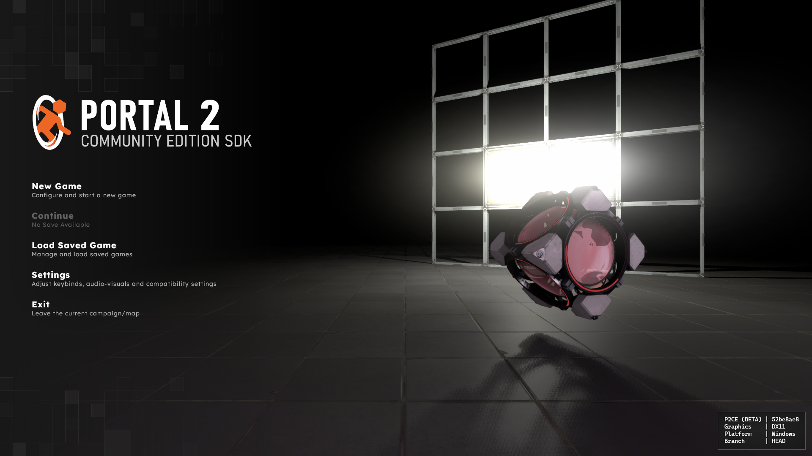
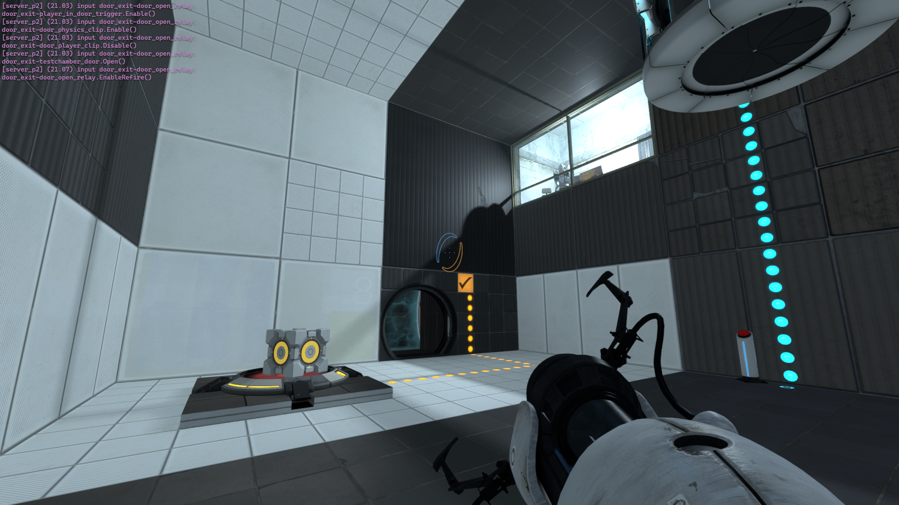
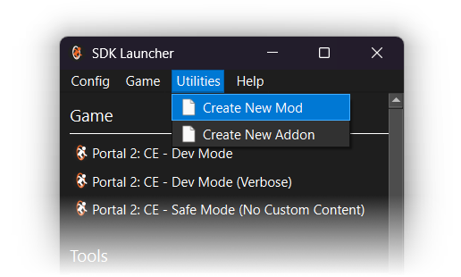
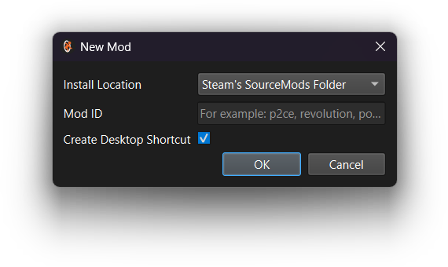
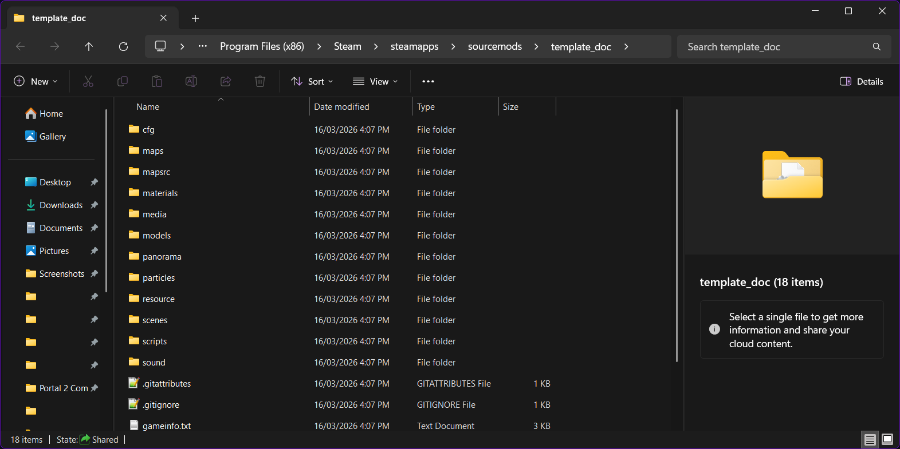
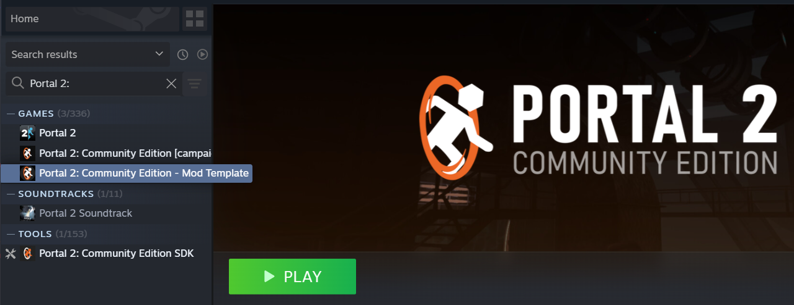

<p align="center">
  <picture>
    <source media="(prefers-color-scheme: dark)" srcset=".assets/logo_white.svg"/>
    
  </picture>
</p>

This is a basic skeleton that can be used to create mods building upon the Portal 2: Community Edition feature set. It has one sample campaign with a single test chamber that can be played through to completion.

<p align="center">
  <picture>
      
  </picture>
</p>

<p align="center">
  <picture>
      
  </picture>
</p>

## Setup Instructions

### SDK Launcher
From the P2:CE SDK launcher, select the Utilties drop-down and click on "Create New Mod":
<p align="center">
  <picture>
      
  </picture>
</p>

The SDK launcher will prompt for an install location and a mod ID (your mod's internal name). A desktop shortcut to your mod's working directory can also be optionally specified.

<p align="center">
  <picture>
      
  </picture>
</p>

Your newly-created mod will be downloaded and placed in the appropriate directory, depending on the install location you have selected:
<p align="center">
  <picture>
      
  </picture>
</p>

### Git
Clone this repository into a new working tree directory using the following commands:

```bash
mkdir p2ce-mod-work
cd p2ce-mod-work
git clone https://github.com/StrataSource/p2ce-mod-template.git my-new-mod-name --recurse
```

Then, rename `p2ce-mod-template_english.txt` in the `resources` directory to `[mod-name]_english.txt` to enable mod-specific localization.

## Launch Options

### Steam Client
Mods can be launched directly from the Steam client if placed in the `SteamApps/sourcemods` folder:

<p align="center">
  <picture>
      
  </picture>
</p>

Note that you must quit and relaunch Steam for your mod to show up when you first create it.

### Command Line
Launching your mod can also be done programmatically via the P2:CE executable. Pass `-game "path\to\mod"` along with any additional command-line arguments to the P2:CE game executable in your game install.

To launch on Windows:
```sh
"X:\path\to\steam_library\SteamApps\common\Portal 2 Community Edition\bin\win64\p2ce.exe" -game "X:\path\to\mod"
```

To launch on Linux:
```sh
"path/to/steam_library/SteamApps/common/Portal 2 Community Edition/p2ce.sh" -game "path/to/mod"
```
